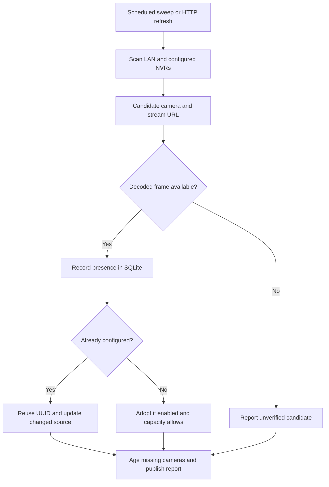
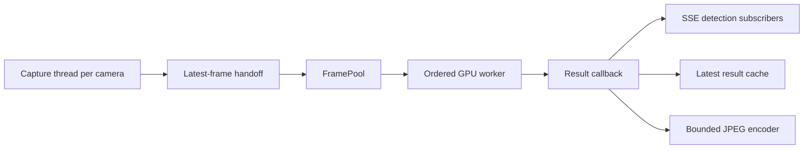

# Camera discovery and detection

Start here when reading this service for the first time. It runs on a Jetson
with TensorRT 10 and has two connected pipelines:

- **Discovery:** find camera candidates, confirm they produce video, remember
  their identity, and add them to the running service.
- **Detection:** capture frames, select recent frames fairly, run YOLO, and
  publish detection events and optional JPEG snapshots.

The cloud backend handles tracking, recordings, and alerts. This service sends
camera inventory and detection metadata to it.

## Read the code in this order

| File | Responsibility |
| --- | --- |
| `main.py` | Load `.env`, create the runtime, and register HTTP routes |
| `runtime.py` | Own the event loop; validate, restore, add, update, and remove cameras |
| `service.py` | Schedule discovery and turn verified candidates into camera configurations |
| `discovery.py` | Probe LAN cameras/NVRs and build candidate stream URLs |
| `pipeline.py` | Connect capture, buffering, inference results, snapshots, and subscribers |
| `frame_pool.py` | Keep a bounded, fair queue of recent frames |
| `inference_worker.py` | Run ordered batches on the GPU's dedicated thread |
| `trt_infer.py` | Prepare model input, execute TensorRT, and parse detections |
| `channels/channel.py` | Open streams, sample frames, and reconnect after failures |
| `channels/gstreamer_capture.py` | Read native GStreamer samples into owned BGR arrays |
| `repositories/` | Read and write saved camera configurations and discovery history |
| `routes/` | Translate HTTP requests into runtime calls |
| `lifecycle.py` | Drain workers when the standalone server exits |

`env_utils.py` provides shared environment parsing. `limits.py` defines camera
admission policy. `database_orm.py` defines the two database tables; `database.py`
and the migration files preserve older installations.

## Startup

1. `main.py` loads `.env` before importing modules that read configuration.
2. `create_app()` constructs `PipelineRuntime` unless a caller supplies one.
3. The runtime initializes SQLite and starts an asyncio loop on a background thread.
4. `SimpleInferencePipeline.start()` starts the GPU worker and waits for TensorRT
   initialization. A failed engine load fails startup instead of reporting ready.
5. The runtime restores saved camera configurations. Disabled cameras remain
   saved without starting capture; enabled cameras must fit `MAX_CAMERAS`.
6. Discovery starts on its own thread. Flask routes use the runtime stored in
   `app.extensions`, so separate application instances keep separate state.

Run one service process per GPU. The development reloader is disabled because
it would start a second runtime.

## Discovery, step by step



`DiscoveryService._sweep()` is the orchestration function. It calls
`scan_network()`, checks each candidate with `_inspect_candidate()`, applies
verified source changes, marks missing cameras, then publishes one complete report.

Network discovery combines ONVIF WS-Discovery, Hikvision ISAPI probes, configured
remote NVRs, and static NVR channel declarations. These produce **candidates**.
An HTTP response or a configured NVR channel alone is not proof of working video.

`PipelineRuntime.verify_source()` checks recent frames from an existing capture
when possible. Otherwise it opens a temporary capture, waits for a decoded
frame, and releases it. Only verified candidates enter the discovered roster.

Identity prefers serial number, then MAC, then IP. NVR identities include the
channel so inputs sharing one recorder do not become one camera. Matching an
existing configuration prefers its saved roster link and discovery identity,
then the stream endpoint without credentials. Host-only fallback applies to
direct cameras, never NVR inputs.

New cameras receive a UUID and discovery provenance. Adoption calls
`runtime.add_camera()`, which validates capacity, starts the channel, and saves
its configuration. A camera rejected at capacity remains in the roster and is
retried on a later sweep. `DISCOVERY_AUTO_ADD=false` reports cameras without
starting their detection channels.

Missing cameras retain their history and UUID. They become missing after
`DISCOVERY_MISS_THRESHOLD` consecutive missed sweeps; recovery clears the missing
state. A cancelled sweep does not age untested cameras. Concurrent sweeps share
one lock to avoid duplicate adoption.

`POST /sync` requests a background refresh and returns the most recent completed
report immediately. Poll `/discovery/report` for the new report. For network,
credential, and NVR configuration details, read [DISCOVERY.md](DISCOVERY.md).

## Detection, step by step



1. `VideoChannel` opens the configured stream, preferring hardware decode where
   supported. Its capture thread samples frames at `sample_fps` and reconnects
   with backoff after failures.
2. The handoff keeps only the latest pending frame. `_pump_channel()` puts
   detection-enabled frames into `FramePool` on the asyncio thread.
3. `FramePool` discards stale frames and evicts the oldest frame from the camera
   with the largest backlog when full. Batches take one frame from each ready
   camera before taking a second. A silent camera never blocks others.
4. `_pump_inference()` waits for worker queue capacity before drawing a batch.
   `_prepare_frame_job()` attaches camera identity, sequence, timestamp, and a
   completion callback to each frame.
5. `InferenceWorker` runs the batch on its CUDA-owning thread. `TRTInfer` resizes
   and letterboxes images, normalizes RGB input, executes TensorRT, and maps
   filtered detections back to each frame's dimensions.
6. `_handle_result()` updates metrics and the latest result, broadcasts the event,
   and optionally schedules a JPEG. One encoder thread keeps snapshot work bounded.
7. Slow SSE clients discard their oldest queued event. Empty detection events
   normally remain enabled so the cloud tracker can age objects that disappeared.

The single GPU worker preserves per-camera ordering and avoids duplicate engines.
The dispatcher respects the engine's actual batch limit. Timeout failures are
counted; successful late results can still be delivered. Camera replacement
changes a generation token, preventing old results from repopulating its cache.

Do not remove the queue bounds, cancellation handling, generation checks, or
reconnect logic merely to shorten the code. They keep a busy or disconnected
camera from disrupting other cameras.

## Configuration and running

Use [`.env.example`](.env.example) as the configuration reference. Keep actual
credentials in `.env`. The main groups are:

| Settings | Purpose |
| --- | --- |
| `DET_ENGINE`, `IMG_SZ`, `CONF` | Model engine, input size, confidence threshold |
| `MAX_CAMERAS`, `DEFAULT_SAMPLE_FPS` | Admission limit and default sampling rate |
| `DEFAULT_RESIZE_W`, `DEFAULT_RESIZE_H` | Capture resize bounds |
| `FRAME_POOL_CAP`, `FRAME_MAX_AGE_MS`, `INFER_MAX_BATCH` | Bounded inference workload |
| `DISCOVERY_*`, `HIK_*`, `NVR_*`, `STATIC_NVRS` | Discovery schedules, addresses, credentials |
| `ENABLE_SNAPSHOT_CACHE`, `SNAPSHOT_*` | JPEG cache behavior |

Saved per-camera settings survive restart. Editing a default in `.env` does not
rewrite existing camera configurations.

Follow [deployment/README.md](deployment/README.md) to install JetPack dependencies
and build the engine on the target device. Then run from this directory:

```bash
.venv_trt/bin/python main.py
```

`requirements-jetson.txt` is for the current TensorRT 10 service. The legacy Nano
setup and `requirements.txt` are retained for historical deployment reference;
they do not make this revision compatible with TensorRT 8.

## Verification and troubleshooting

Run all off-device regression suites with one command:

```bash
python3 tests/run_tests.py
# Or selected suites:
python3 tests/run_tests.py test_frame_pool.py test_dispatch.py
```

Use a Python environment with Flask, NumPy, OpenCV, SQLAlchemy, and aiosqlite.
On the Jetson, use JetPack's OpenCV and NumPy. The runner starts each suite in a
separate process because tests stub GPU and capture imports. Discovery integration
tests start a fake camera on localhost and need permission to bind a local socket.
They do not scan or modify real cameras.

The tests cover discovery, identity matching, frame verification, migrations,
queue fairness, late results, capacity, reconnect behavior, native sample handling,
route isolation, and shutdown. They cannot prove GPU throughput or real-camera
compatibility. Use `tests/diag_batch.py` and `deployment/check_capacity.py` on the
Jetson as described in [ARCHITECTURE.md](ARCHITECTURE.md).

Start debugging with `/health`: check inference readiness, capture status, frame
age, dropped frames, and per-camera results. Use `deployment/diagnose_discovery.py`
for discovery and `deployment/audit_cameras.py` to compare saved configurations.
Keep the model assets and migration scripts until the deployment no longer needs
them; the current default model is not enough evidence that alternatives are unused.
