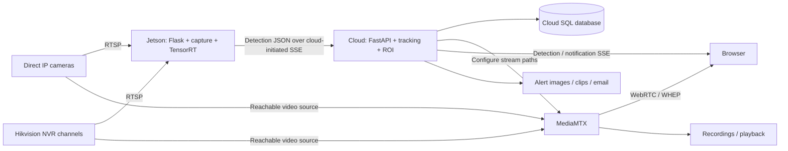

# 01 — Architecture and repository map

## The four running systems

The edge service is Flask. The cloud service under `Backend/` is FastAPI, started with Uvicorn in its Dockerfile. They have similarly named classes but perform different jobs.

The arrows describe logical flow. The cloud opens the HTTP connections to the edge; the edge does not initiate a registration webhook to the cloud in this implementation. A working tower LAN does not by itself make `device_url` or the camera RTSP URLs reachable from the cloud/media server.

For a portable tower behind cellular NAT, explicitly design the private network/VPN or relay path. This repository's discovery scanner does not create a VPN, port forwarding, or a public RTSP relay. In particular, `public_rtsp_url` on the edge roster is assigned the same local `source_url`; its name does not make it public.

## Responsibility map

| Location | Responsibility | Does not establish |
| --- | --- | --- |
| [`discovery.py`](../discovery.py) | WS-Discovery, Hikvision ISAPI, NVR declarations, candidate identities | Working video |
| [`service.py`](../service.py) | Select, verify, adopt, and report candidates | Cloud site assignment |
| [`runtime.py`](../runtime.py) | Bridge Flask/discovery threads into the asyncio loop; save configurations | GPU capacity from camera count alone |
| [`channels/channel.py`](../channels/channel.py) | Decode, sample, reconnect, hand frames to asyncio | Object identity across frames |
| [`pipeline.py`](../pipeline.py) | Bounded scheduling, futures, results, snapshots, edge SSE | Business alert policy |
| [`inference_worker.py`](../inference_worker.py) | One ordered thread owning TensorRT/CUDA | Parallel GPU engines per camera |
| [`trt_infer.py`](../trt_infer.py) | Tensor preparation, GPU execution, output parsing | Tracking or ROI rules |
| [`cloud manager`](../../application/services/manager/service.py) | Camera lifecycle, per-user pipelines, device reconciliation | RTSP decoding on the cloud API |
| [`cloud pipeline`](../../application/services/pipeline.py) | Consume edge JSON, track objects, evaluate ROI, publish overlays | Video transcoding |
| [`webrtcgateway.py`](../../application/services/webrtcgateway.py) | Configure MediaMTX stream paths | A decoded frame or successful browser playback |
| [`Frontend`](../../../Frontend/rtsp-ui/src/app/app.js) | Fetch inventory, play video, render overlays and notifications | GPU inference |

## Edge startup: exact sequence

Read [`main.py`](../main.py), `PipelineRuntime.__init__`, `_run_loop`, and `SimpleInferencePipeline.start` together.

1. `main.py` tries to load `Backend/tensort/.env` before importing the runtime. Environment values already supplied by the process can take precedence over dotenv values.
2. `create_app()` creates a Flask app and a `PipelineRuntime` unless a test supplies one.
3. The runtime initializes the SQLite schema through `CameraRepository.initialize_tables()`. A failure is logged; construction does not immediately abort at that check.
4. A daemon thread named `pipeline-loop` creates its own asyncio event loop. A thread does not automatically have an asyncio loop.
5. That thread constructs `SimpleInferencePipeline` and awaits `start()`.
6. The pipeline starts one `trt-infer-worker-0` thread. That worker imports the TensorRT runner and loads the engine. The pipeline waits for its initialization event, with a 60-second worker readiness timeout. The outer runtime waits up to 65 seconds.
7. Startup sets the effective batch size to the smaller of the configured batch limit and the actual engine limit. An engine load failure propagates as startup failure.
8. **Manual mode:** saved camera configurations are restored immediately after pipeline readiness.
9. **Discovery-managed mode:** immediate restore is skipped. `discovery_managed` is true when both `DISCOVERY_ENABLED` and `DISCOVERY_AUTO_ADD` are true. The first discovery selection restores only saved configurations whose exact source URLs belong to that selection.
10. `create_app()` starts the discovery scheduler, registers blueprints, and stores the runtime in `app.extensions['pipeline_runtime']`.
11. Standalone `serve()` runs Flask with threading enabled and its development reloader disabled.

This order matters: `pipeline_ready=true` can precede camera discovery and the first captured frame. It is not a claim that every configured camera is detecting.

Older README wording says cameras are restored before discovery. That is incomplete for the current discovery-managed branch. Follow the executable condition in `runtime.py`.

## Cloud startup

[`Backend/main.py`](../../main.py)'s FastAPI lifespan initializes the SQL database, notification service, Manager, retention service, and report scheduler. It then asks the Manager to load users' background pipelines and starts edge reconciliation and retention tasks.

`Manager.start_background_pipelines()` iterates users sequentially. `PipelineController._create_pipeline_unlocked()` loads camera configuration and device assignments, builds cloud `VideoChannel` objects, and associates the `ModelPipeline` with its user. The controller wires and starts that pipeline through its lifecycle methods. Each enabled detection channel eventually runs a persistent edge SSE consumer.

The cloud does not deserialize the Jetson TensorRT engine. Its `VideoChannel` is an HTTP client, while the edge's `VideoChannel` is a video decoder. When debugging imports, always include the full path.

## IDs: one physical camera, several identifiers

| Name | Example | Meaning |
| --- | --- | --- |
| Discovery identity | `serial:CAM-SERIAL-A` | A physical-camera matching key |
| NVR discovery identity | `ip:192.168.50.200#2` | Recorder endpoint plus input channel when serial/MAC are unavailable |
| `camera_uuid` | `11111111-1111-4111-8111-111111111111` | Edge event key and cloud Camera key; must align |
| `channel_id` | Usually the same UUID | Capture/channel identifier |
| `device_uuid` | A different UUID | Cloud row representing the Jetson |
| `camera_code` | `cam-11111111` | MediaMTX stream key generated from a camera UUID prefix |
| `pipeline_id` | Another UUID | Cloud user's pipeline, not a CUDA context |
| `site_uuid` | Another UUID | Site, schedule, organization, and permission context |
| `frame_seq` | `42` | Per-capture-instance frame sequence; can reset when capture is replaced |
| `track_id` | `7` | Cloud tracker-local object identity; not a camera ID |

Example: edge detection is published for camera A, but the cloud creates camera B for the same RTSP URL. A correct network path and healthy GPU will not fix this: the cloud subscribes to B's SSE route and the edge emits A's events. See the inventory UUID finding in document 08.

## Persistent versus volatile state

| State | Location | Survives restart? |
| --- | --- | --- |
| Edge saved camera configuration | SQLite `camera_configs` | Yes |
| Edge discovery history and UUID link | SQLite `discovered_cameras` | Yes |
| Selected discovery identities | `DiscoveryService._selected_identities` | No |
| Last discovery report | Service memory | No |
| Decoded frames, futures, latest detections | Edge process memory | No |
| JPEG snapshot cache | Edge process memory | No |
| Cloud users/sites/devices/cameras/configurations | Cloud SQL database | Yes |
| Cloud inventory | `CameraInventory` rows | Yes |
| Live tracks, latest overlay, SSE subscriptions | Cloud process memory | No |
| Notification/clip metadata | Cloud SQL database | Yes, after commit |
| Media bytes | Configured storage/recordings | Depends on deployment retention |

Do not use a process-local dictionary as if it were shared across Uvicorn workers. Each worker would load its own Manager, trackers, background loops, and SSE consumers. The supplied Docker command does not specify multiple workers. Horizontal scaling requires explicit ownership and shared messaging/storage design.

## Shutdown and ownership

[`lifecycle.py`](../lifecycle.py) catches termination and calls `runtime.close()`. Discovery is stopped, capture pumps are cancelled, capture threads are signaled, inference shuts down, native threads are joined, and only then is the asyncio loop stopped. CUDA buffers are released by the inference thread that created them. Capture handles are released by their capture thread.

The normal channel stop uses a bounded six-second join through an executor so the asyncio loop is not blocked. Final process shutdown uses unbounded joins to avoid native resources surviving interpreter teardown. A hung driver may therefore delay shutdown; measure that separately from request latency.

## Wider repository

The cloud's `routes/` layer performs HTTP parsing and authorization. `application/repositories/` handles SQL queries and persistence. `core/database_orm.py` defines organizations, grants, sites, devices, inventory, cameras, pipelines, configurations, video records, notifications, walls, and reports. `domain/events.py` defines channel lifecycle events. The notification subsystem separates buffering/persistence, clips, email, and live delivery.

Auth, reports, retention, public walls, bulk deletion, and frontend forms are relevant supporting systems, but they are not the GPU path. This handbook deeply reviews the camera/detection path and its integrations; it is not a claim of a complete security or behavioral audit of every unrelated feature. For the camera path specifically, [document 09](09_DISCOVERY_FLOW_END_TO_END.md) traces one camera through every one of these components in order, with the values each hop produces.
