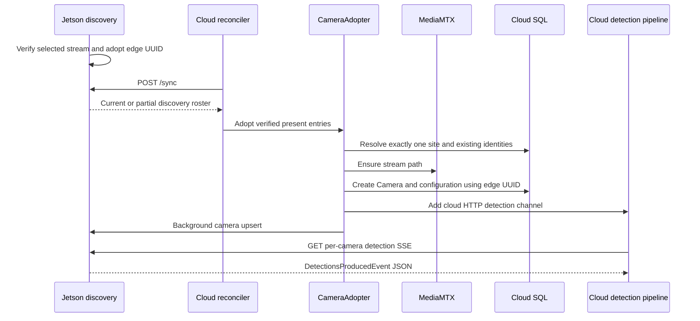

# 05 — Cloud registration, tracking, SQLAlchemy, and alerts

## Camera appearance is a pull-and-adopt workflow

The cloud Manager periodically reconciles enabled devices. It reaches the Jetson's `device_url`, calls `/sync`, and reads its camera inventory. There is no edge-initiated push to a cloud registration endpoint in the reviewed path.



The sequence illustrates successful automatic adoption. Operations span several systems and are not one atomic database transaction.

## Reconciliation order and its latency

Read [`DeviceReconciler.reconcile_device_edge_simple`](../../application/services/manager/controllers/reconcile.py).

1. Read the device URL and logical peer device rows in the same organization.
2. Compute desired detection cameras from database settings/schedules and active video streams separately.
3. Query MediaMTX paths and provision missing video paths for existing cameras.
4. Ask the edge for discovery using `sync_discovery()`.
5. Adopt verified roster entries into the cloud.
6. Re-read desired state if adoption or source repointing changed cloud rows.
7. Read edge camera UUIDs.
8. Compute additions/removals and protect discovered entries from accidental deletion.
9. Read the edge selection policy. If it reports `camera_selection='discovery'`, clear ordinary `to_add` and `to_remove` lists.
10. For manual devices, check capacity and issue allowed mutations; separately patch repointed sources.

This order means slow media-server administration can delay discovery adoption even when the edge is healthy. Devices are reconciled sequentially in `reconcile_all_devices_edge()`. One slow/unreachable device can delay later devices.

`EDGE_RECONCILE_INTERVAL_S` defaults to 30 seconds **after a reconciliation pass**, not a guaranteed 30-second start-to-start period. HTTP retries and outer device retries add further work. The main loop's failure counter is global to the pass, although its docstring suggests per-device backoff. Check actual error aggregation before using “one device backs off independently” as an operational assumption.

`EdgeInferenceClient` tries prefixed/unprefixed endpoint variants, retries transient failures, and treats 400/409/422 as terminal errors for that request. Its general default timeout is 15 seconds, list timeout 5 seconds, sync timeout 45 seconds. The Manager also wraps external calls, normally at 10 seconds or the sync-specific timeout. Nested deadlines can truncate inner retries.

## Adoption requirements

[`CameraAdopter`](../../application/services/manager/controllers/adopt.py) filters for present roster entries with a usable URL, excludes `verification_state='unverified'`, and skips capacity-rejected identities. It then requires exactly one active site linked to the target device.

```text
Device has no site:    adoption returns an explanatory error
Device has two sites:  adoption returns ambiguity error
Device has one site:  identity matching and camera creation can proceed
```

For a movable tower, site reassignment must be deliberate. Discovery can know which camera responds on Ethernet; it cannot infer which customer's site should own its cloud row.

Automatic adoption reuses the edge `camera_uuid`. It stores discovery provenance in channel configuration, then uses the normal channel-create path. That path generates `camera_code='cam-'+uuid.hex[:8]`, creates/updates the MediaMTX path, upserts the camera/configuration, creates the cloud `VideoChannel`, and schedules an edge upsert.

**Current defect:** the explicit inventory-add path uses `InventoryService._adoption_entry()`, which does not carry `edge_camera_uuid` into `camera_uuid`. `_create_camera()` can therefore generate a different UUID. See B3 in the optimization report.

**Current behavior:** edge upsert is not idempotent at the capture-resource level. Even an unchanged upsert invokes `pipeline.add_channel()`, stops the old channel, clears caches, and starts a new generation. Automatic adoption can briefly interrupt a camera that discovery just started.

## CameraInventory and Camera are different tables

`CameraInventory` remembers reported devices and user add/remove decisions. `Camera` is the application camera used for site ownership, video, tracking, and permissions. A discovered edge row is not automatically an inventory row or a fully usable application camera.

`InventoryService.refresh_from_device()` reads the last **completed** discovery report using `fetch_discovery_report()`. The device inventory refresh route does not itself force a new network scan. Before the first edge sweep completes, it can have no new report to import even while `/sync` exposes partial active rows.

Inventory responses use a redacted `source`; edge camera/roster APIs expose the real connection URL. Treat captured JSON/logs accordingly when sharing diagnostics.

Identity matching also differs between sides. The edge compares full credential-free stream endpoints before direct-camera host fallback. Cloud automatic adoption indexes discovery identity and a direct-camera host fallback; it does not build a full stream-endpoint index for manually created NVR rows without provenance. Aligning these contracts is a future cleanup task, especially when manually registered and automatically discovered cameras coexist.

## SQLAlchemy explained through this code

An **engine** manages database connectivity and a pool. A **session** tracks ORM objects and their transaction. A session is not the database itself. A **commit** makes the transaction durable; changing a Python object does not guarantee other sessions can see the change yet.

Illustrative async pattern:

```python
async with session_factory() as session:
    result = await session.execute(select(Camera).where(Camera.camera_uuid == camera_uuid))
    camera = result.scalar_one_or_none()
    if camera is not None:
        camera.source_url = new_source_url
        await session.commit()
```

Each concurrent task should own its own AsyncSession. A shared session must not be used concurrently by multiple tasks. SQLAlchemy states the model as Session per thread and AsyncSession per task in its [session documentation](https://docs.sqlalchemy.org/en/20/orm/session_basics.html).

The edge uses two engines for one SQLite file: synchronous SQLite access on discovery/restore paths, and async `sqlite+aiosqlite` access for saved camera writes. `check_same_thread=False` permits the sync driver's connections to be used under its configured threading model; it does not make one Session safe to share between threads.

Cloud database configuration supports MySQL/MariaDB or SQL Server based on its connection-string parsing. Sync and async engines have separate pools. Defaults are pool size 30 and overflow 20 **per engine**, so potential connections are not capped at 50 for an entire replicated deployment. Pools are lazy, but each process/engine still needs a capacity budget.

For plain JSON columns, replace the dictionary to make changes visible to SQLAlchemy:

```python
updated = dict(channel_config.configuration or {})
updated["discovery_identity"] = "serial:CAM-SERIAL-A"
channel_config.configuration = updated
```

`_sync_existing_camera()` uses that approach. An in-place nested edit is not automatically tracked by every JSON column configuration.

Edge `CameraRepository.save()`/`delete()` catch and log errors. The runtime can report success even if persistence failed. Conversely, a caller timing out while waiting on `_call()` does not automatically cancel its queued coroutine. Both behaviors complicate operator expectations and recovery; document 08 gives acceptance criteria for changing them.

## Receiving detections: SSE, not video frames

[`application/channels/channel.py`](../../application/channels/channel.py) opens one long-lived SSE stream per camera. It tries `/api/cameras/{uuid}/detections/stream` and the unprefixed equivalent. It collects `data:` lines until a blank line, parses JSON, and ignores comment lines such as `: keepalive`.

Edge example on the wire:

```text
data: {"type":"DetectionsProducedEvent","camera_uuid":"11111111-1111-4111-8111-111111111111","frame_seq":42,"frame_ts_ms":1800000000000,"detections":[]}

: keepalive

```

An SSE heartbeat proves the HTTP connection is alive. It does not prove the camera produced another frame. A successful event with `detections=[]` means inference completed and found no surviving objects. `InferenceFailedEvent` means the inference path failed. Keep these cases separate.

The cloud `_stream_loop()` retries with backoff from 0.5 to 5 seconds and startup jitter up to 100 ms. It waits while detection is disabled. Its shared module-level HTTPX client has `max_connections=100`; each long-lived SSE consumes a connection. Snapshot/latest reads share that client. A single eight-camera tower is unlikely to exhaust it by itself, but a cloud process serving many towers can.

The CRUD edge client can attach `EDGE_API_KEY`; the detection channel client does not attach that key to SSE/latest/snapshot requests. If a deployment gateway requires it, registration calls can work while detection reads fail. The edge routes themselves do not enforce an API-key check in this checkout. See the conditional authentication finding in document 08.

## Payload validation and ordering

`_payload_to_resp()` requires `frame_seq` and `frame_ts_ms`, optionally unwraps a nested payload, suppresses duplicate boxes, and verifies that any supplied camera UUID matches the subscribed channel.

`_is_new_detection()` compares `(timestamp, sequence)` with the previous tuple. Identical/older events are normally ignored. After a gap exceeding five seconds, a regressed tuple can be accepted as a possible edge restart. There is no general “discard every frame older than FRAME_MAX_AGE_MS on the cloud” check in this function. The edge pool age limit and the cloud ordering check solve different problems.

The clock-skew monitor warns but does not adjust timestamps or reject frames. A positive lag floor can reflect both persistent pipeline latency and clock offset; it is an estimate, not a direct NTP measurement.

## Tracking with concrete scores

[`ByteTrackLite`](../../application/services/tracker.py) is a custom ByteTrack-style tracker, not a full appearance/ReID model. It matches boxes over time using overlap and a movement-aware distance fallback, maintains class votes, and tracks hits/misses.

```text
Frame 1: person score 0.83 -> new tentative track, hits=1
Frame 2: matching person score 0.76 -> same track, hits=2
Frame 3: matching person score 0.81 -> hits=3, confirmed
Frame 4: matching person score 0.28 -> low-confidence association can rescue track
Frame 5: no detection -> misses increase; track may be retained internally
```

A second confirmation path allows at least two hits plus sufficient track age, useful at low FPS. Default `confirm_max_s=1.5` is not a forced 1.5-second wait for every track: three hits can confirm sooner. The tracker does not emit coasting tracks by default; raw detections can still be drawn independently of confirmed tracks.

Observed inter-frame time adapts stale/movement thresholds. At 0.5-second intervals, default stale budget is approximately `0.5 × 8 × 1.5 = 6 seconds`, subject also to miss-count conditions. That controls internal track retention, not how long the browser displays a box.

## ROI, overlay publication, and alerts

The cloud processing order is:

```text
normalize/dedupe payload
  -> update per-camera tracker
  -> fetch cached ROI if tracks need it
  -> evaluate ROI
  -> put latest response and publish detection hub
  -> spawn post-publication overlay/notification work
```

`_fetch_rois()` can query SQL before the live overlay is published. Its normal cache TTL is 30 seconds. On an exception with an expired cached value, the current fallback returns stale data without extending the cache deadline, so subsequent frames can repeatedly try the failing database. This is a specific latency risk; snapshot/clip persistence is mostly moved after publication, but ROI lookup still lies on the consumer path.

ROI polygons can use normalized coordinates. For a 640×360 frame, `(0.25,0.5)` corresponds to pixel `(160,180)`. The engine scales normalized polygons or reference-frame polygons into the event's frame size. The normal loaded ROI defaults to bounding-box/polygon intersection (`anchor="bbox"`); the engine also supports center and bottom-center anchor modes. It applies hit hysteresis, class selection, and cooldown/spatial suppression; a drawn detection does not necessarily satisfy a new-entry alert.

A notification must additionally pass camera notification settings, site arm override/schedule, and trigger mode (`roi_enter`, `any_detection`, or inherited policy). The default site trigger resolver uses `roi_enter`. A site with no suitable ROI and that mode can show detections without broad “object detected” alerts.

If operator approval is required, `_publish_and_persist()` withholds immediate end-user notification publication. Otherwise it can publish to the live hub before persistence finishes. Despite retained buffer configuration and a background flush loop, the current `NotificationFlusher.enqueue()` immediately prepares the item, calls `_flush_user_batch()` with its session, and commits on success. It does not add the item to the old pending buffer. Do not attribute current alert delay to `NOTIFICATION_BUFFER_MAX_AGE_S=60`; inspect immediate database/media work and approval policy instead. The retained buffer machinery is cleanup debt.

Clip capture and alert image materialization use separate services. The cloud requests the latest edge JPEG, which is asynchronously cached and normally throttled to once per second on detection-bearing frames. It is not guaranteed to be the exact image for the requested event timestamp. MediaMTX recordings and overlay history are combined for playback.

## Browser behavior

[`detection/overlay.js`](../../../Frontend/rtsp-ui/src/app/detection/overlay.js) consumes cloud SSE and draws boxes on top of separate video playback. It learns arrival cadence and expires live overlays using `clamp(interval×1.0, 500, 1500)` milliseconds, with 1000 ms before a cadence is learned. Fading begins halfway through that window.

At one detection every 2 seconds, the maximum 1.5-second overlay lifetime leaves a visible gap even if delivery is regular. At fast object speed, old boxes also lag behind live video because the streams have independent latency. Increasing overlay hold time can hide gaps while increasing stale boxes; fix the underlying cadence/latency first.

[`app.js`](../../../Frontend/rtsp-ui/src/app/app.js) schedules normal data refresh every 30 seconds, with visibility/lifecycle conditions. Camera creation in SQL can therefore precede its appearance in an already open browser. Compare the cloud camera API directly before blaming discovery.
